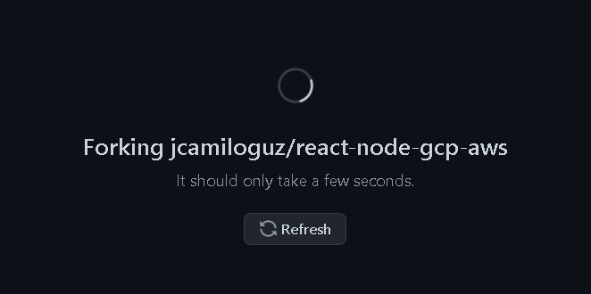
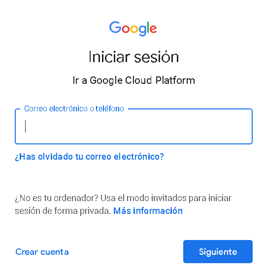
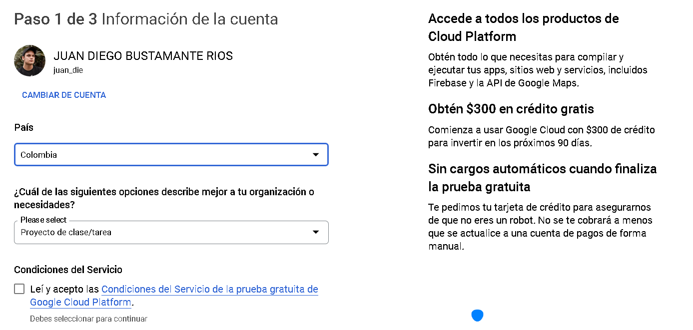
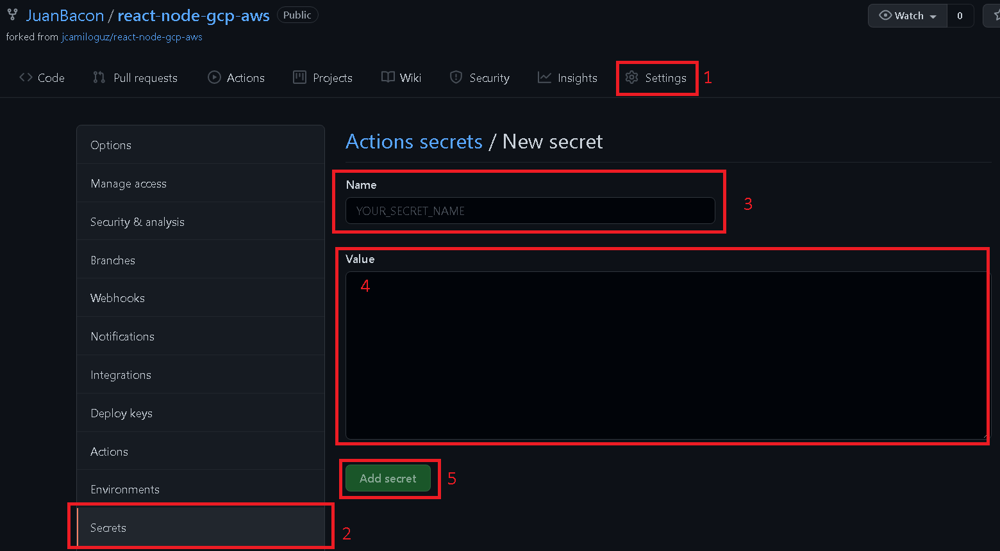
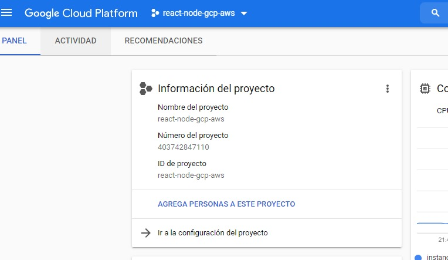
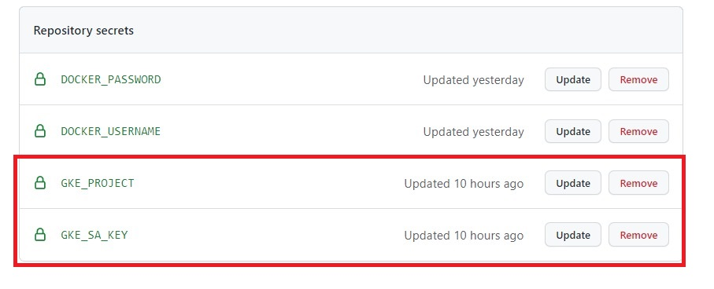

# Multi-Cloud application Google Cloud Platform & Amazon Web Services
Este repositorio hace parte de la implementación de una aplicación web Multi-cloud basada en react.js y node.js, que utiliza los servicios de 
[Google Cloud Platform (GCP)](https://console.cloud.google.com/getting-started) para desplegarse en la web y se conecta a una base de datos alojada en el Servicio 
de base de datos relacional [(RDS)](https://aws.amazon.com/es/rds/) de [Amazon Web Services (AWS)](https://aws.amazon.com/es/) utilizando el motor de base de datos [MySQL](https://www.mysql.com/)
y que por medio de [GitHub Actions](https://github.com/features/actions) actualiza, construye y lanza automaticamente la aplicación en producción.
## 🟩Guía paso a paso para la reproducción de la solución.
Para reproducir la solución se tienen que tener en cuenta los siguientes pasos.

### 1. Realizar un Fork al repositorio [jcamiloguz/react-node-gcp-aws.](https://github.com/jcamiloguz/react-node-gcp-aws)
  - En la página principal de este repositorio, en la esquina superior derecha se encuentra la opción de crear un fork a partir de éste, esto permite crear una copia de él que será propia y podremos hacer cambios sin afectar el repositorio original.  
  - Al crear un fork nos aparecerá esta ventana de carga indicando que se está creando un fork correctamente. 
  - Al terminar, ya se contaría con un fork del repositorio original, durante el resto de la guía paso a paso se hará referencia a éste nuevo fork.
### 2. Crear cuenta en [Google Cloud Platform (GCP)](https://console.cloud.google.com/getting-started).
  - Al acceder a la página de [Google Cloud Platform (GCP)](https://console.cloud.google.com/getting-started) se presenta el botón de probar gratis, el cuál permitirá empezar el registro a la plataforma de Google Cloud 
    
  - Para el paso anterior se debe tener una sesión iniciada de Google, en caso tal de no estarlo aparecerá esta ventana permitiendo iniciar sesión o en dado caso de no tener una cuenta de google, [crearla](https://accounts.google.com/signup/v2/) _(Se recomienda utilizar una cuenta institucional)_
    
  - Para terminar el registro en **Google Cloud Platform**, la página pide otros datos, como la región, la razón a utilizar (en este caso, proyecto), tipo de cuenta (en este caso Persona) y un medio de pago (No se harán facturaciones a menos que el usuario active la facturación automática).
    
### 3. Creación de Clúster utilizando Google Kubernetes Engine en **Google Cloud Platform**.
  - A continuación con el [Google Kubernetes Engine](https://cloud.google.com/kubernetes-engine) se crea un Clúster de tipo Load Balancer de Kubernetes que soportará la aplicación web montada.
### 4. Creación de los **secrets** del proyecto en GitHub de las credenciales de Google Cloud Platform.
  - En el aparatado de **Settings** o configuraciones del Fork que se creó en el [punto 1](), en la pestaña de secrets, se pueden crear los secrets que actuarán como variables de entorno necesarias para crear la conexión de la aplicación con el Clúster de Kubernetes.
    
  - Se deben crear dos secrets para el funcionamiento de la aplicación, deben llevar los nombres de: **GKE_PROJECT*** y **GKE_SA_KEY**, es importante copiar correctamente los nombres de estos secrets y sus valores correspondientes, para aclarar mejor esta información se presenta la siguiente tabla como guía. 

| Nombre secret | Valor |
| ------------- | ------------- |
| GKE_PROJECT  | id del proyecto creado en GKE  |
| GKE_SA_KEY  | Llave de seguridad del proyecto en GKE   |

  - Estos valores se pueden encontrar en las configuraciones del Clúster creado en el [punto 3]() como muestra la siguiente imagen:
    
  - El resultado de este paso debe ser similar a esto:
    
### 5. Inicio del Clúster y obtebción de IP externa.
  - Se inicializa la instancia del Cluster y se obtiene la ip externa con la que se accede a la aplicación. (Tener en cuenta el puerto 9000)

## 🟨Guía paso a paso funciones adicionales (Opcionales).
A  continuación se presenta una guía paso a paso para llevar a cabo las siguientes funciones adicionales del proyecto:
- Montaje en Docker Hub.
- Montaje base da datos propia de Amazon Web Services (AWS).
### 1. Creación de cuenta en Docker Hub.
### 2. Creación de los **secrets** del proyecto en Github de las credenciales de Docker Hub.
### 3. Creación de la cuenta en **AWS**.
### 4. Creación de la base de datos en el **Servicio de Base de Datos Relacional** de **AWS**.
### 5. Actualización de las credenciales de la base de datos creada.
