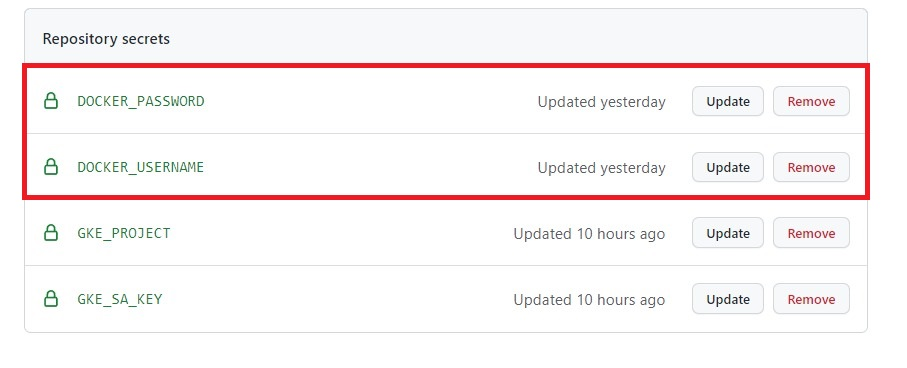

# Multi-Cloud application Google Cloud Platform & Amazon Web Services
Este repositorio hace parte de la implementación de una aplicación web Multi-cloud basada en react.js y node.js, que utiliza los servicios de 
[Google Cloud Platform (GCP)](https://console.cloud.google.com/getting-started) para desplegarse en la web y se conecta a una base de datos alojada en el Servicio 
de base de datos relacional [(RDS)](https://aws.amazon.com/es/rds/) de [Amazon Web Services (AWS)](https://aws.amazon.com/es/) utilizando el motor de base de datos [MySQL](https://www.mysql.com/)
y que por medio de [GitHub Actions](https://github.com/features/actions) actualiza, construye y lanza automaticamente la aplicación en producción.
## 🟩Guía paso a paso para la reproducción de la solución.
Para reproducir la solución se tienen que tener en cuenta los siguientes pasos.

### 1. Realizar un Fork al repositorio [jcamiloguz/react-node-gcp-aws.](https://github.com/jcamiloguz/react-node-gcp-aws)
  - En la página principal de este repositorio, en la esquina superior derecha se encuentra la opción de crear un fork a partir de éste, esto permite crear una copia de él que será propia y podremos hacer cambios sin afectar el repositorio original.  
  - Al crear un fork nos aparecerá esta ventana de carga indicando que se está creando un fork correctamente. 
  - Al terminar, ya se contaría con un fork del repositorio original, durante el resto de la guía paso a paso se hará referencia a éste nuevo fork.
### 2. Crear cuenta en [Google Cloud Platform (GCP)](https://console.cloud.google.com/getting-started).
  - Al acceder a la página de [Google Cloud Platform (GCP)](https://console.cloud.google.com/getting-started) se presenta el botón de probar gratis, el cuál permitirá empezar el registro a la plataforma de Google Cloud 
    
  - Para el paso anterior se debe tener una sesión iniciada de Google, en caso tal de no estarlo aparecerá esta ventana permitiendo iniciar sesión o en dado caso de no tener una cuenta de google, [crearla](https://accounts.google.com/signup/v2/) _(Se recomienda utilizar una cuenta institucional)_
    
  - Para terminar el registro en **Google Cloud Platform**, la página pide otros datos, como la región, la razón a utilizar (en este caso, proyecto), tipo de cuenta (en este caso Persona) y un medio de pago (No se harán facturaciones a menos que el usuario active la facturación automática).
    
### 3. Creación de Clúster utilizando Google Kubernetes Engine en **Google Cloud Platform**.
  - A continuación con el [Google Kubernetes Engine](https://cloud.google.com/kubernetes-engine) se crea un Clúster de tipo Load Balancer de Kubernetes que soportará la aplicación web montada.
### 4. Creación de los **secrets** del proyecto en GitHub de las credenciales de Google Cloud Platform.
  - En el aparatado de **Settings** o configuraciones del Fork que se creó en el [punto 1](https://github.com/jcamiloguz/react-node-gcp-aws#1-realizar-un-fork-al-repositorio-jcamiloguzreact-node-gcp-aws), en la pestaña de secrets, se pueden crear los secrets que actuarán como variables de entorno necesarias para crear la conexión de la aplicación con el Clúster de Kubernetes.
    
  - Se deben crear dos secrets para el funcionamiento de la aplicación, deben llevar los nombres de: **GKE_PROJECT*** y **GKE_SA_KEY**, es importante copiar correctamente los nombres de estos secrets y sus valores correspondientes, para aclarar mejor esta información se presenta la siguiente tabla como guía. 

| Nombre secret | Valor |
| ------------- | ------------- |
| GKE_PROJECT  | id del proyecto creado en GKE  |
| GKE_SA_KEY  | Llave de seguridad del proyecto en GKE   |

  - Estos valores se pueden encontrar en las configuraciones del Clúster creado en el [punto 3](https://github.com/jcamiloguz/react-node-gcp-aws#3-creaci%C3%B3n-de-cl%C3%BAster-utilizando-google-kubernetes-engine-en-google-cloud-platform) como muestra la siguiente imagen:
    
  - El resultado de este paso debe ser similar a esto:
    
### 5. Inicio del Clúster y obtebción de IP externa.
  - Se inicializa la instancia del Cluster y se obtiene la ip externa con la que se accede a la aplicación. (Tener en cuenta el puerto 9000)

## 🟨Guía paso a paso funciones adicionales (Opcionales).
A  continuación se presenta una guía paso a paso para llevar a cabo las siguientes funciones adicionales del proyecto:
- Montaje en Docker Hub.
- Montaje base da datos propia de Amazon Web Services (AWS).
### 1. Creación de cuenta en Docker Hub.
- Para esto se ingresa a [Docker Hub](https://hub.docker.com/) y en la pantalla principal está el formulario para crear una cuenta, ingresar el Docker ID, un correo electrónico y la contraseña
   
- Una vez creada la cuenta tener en cuenta **(DOCKER ID)** y **(Password)**, estos valores se necesitarán para la creación de los **secrets**.
### 2. Creación de los **secrets** del proyecto en Github de las credenciales de Docker Hub.
- Al igual que en el [punto 4](https://github.com/jcamiloguz/react-node-gcp-aws#4-creaci%C3%B3n-de-los-secrets-del-proyecto-en-github-de-las-credenciales-de-google-cloud-platform) de la guía anterior se repite el mismo proceso de acceder a **Settings** y a **Secrets** para crear dos nuevos secretos relacionados con las credenciales de docker, deben llevar los nombres: **DOCKER_USERNAME** y **DOCKER_PASSWORD, estos datos son resultado del punto anterior, igualmente puede tomar la siguiente tabla como gúia. 

| Nombre secret | Valor |
| ------------- | ------------- |
| DOCKER_USERNAME  | Docker id   |
| DOCKER_PASSWORD  | Contraseña de la cuenta docker    |

- El resultado de este paso debe ser similar a esto:
  

### 3. Creación de la cuenta en **AWS**.
- Este paso es similar al [punto 2](https://github.com/jcamiloguz/react-node-gcp-aws#2-crear-cuenta-en-google-cloud-platform-gcp) de la guía anterior, pero esta vez se creará una cuenta de capa gratuita accediendo a la [plataforma de Amazon Web Services](https://www.google.com/aclk?sa=L&ai=DChcSEwjEoeXxpo70AhVCsYYKHQbCDgMYABABGgJ2dQ&ae=2&sig=AOD64_2XCxJ0ut9nQFwPSdHuyIbp_1UHNw&q&adurl&ved=2ahUKEwjs-tzxpo70AhXiTDABHa3LA1UQ0Qx6BAgDEAE), al dar click sobre **crear una cuenta gratuita** se desplegará la siguiente interfaz para comenzar con la creación de la cuenta:
  
- Se pedirán datos como la región, el propósito de la cuenta, número celular y datos de facturación (Al igual que con **Google Cloud Platform** todo se trabaja sobre la capa gratuita y no se harán cobros a menos de que se utilicen servicios fuera de esta capa)
### 4. Creación de la base de datos en el **Servicio de Base de Datos Relacional** de **AWS**. 
- En la consola de AWS, en la barra de búsqueda superior buscar **RDS**, el servicio de bases de datos relacionales y en el dashboard de este servicio, buscar la opción de **Crear una base de datos**
  
- Para las configuraciones de ésta base de datos los aspectos más importantes son los de seleccionar MySQL, en su versión community, puede ser la más actualizada, seleccionar los recursos de la capa gratuita y las credenciales de acceso
- Seleccionar MySql (última versión) y capa gratuita
  
- Digitar las credenciales de acceso a la base de datos (Importante tener en cuenta el **usuario maestro** y la **contraseña maestra**)
  
- Importante seleccionar el **tipo de autenticación** en: (Autenticación con contraseña), la **conectividad VPC** en default y el **acceso público** activado
- Para mayor información sobre la creación de ésta base de datos puede seguir [esta guía](https://aws.amazon.com/es/getting-started/hands-on/create-mysql-db/)
### 5. Actualización de las credenciales de la base de datos creada.
- Una vez creada la base de datos, en el dashboard se encuentra la pestaña de conectividad y seguridad, se encuentran las demás credenciales necesarias para la conexión a la base de datos, que son el punto de enlace y el puerto de enlace, como lo muestra la siguiente imagen:
  
- En este sentido las credenciales que hay que tener en cuenta para conectar la base de datos a la aplicación son:
 
| Nombre variable | Valor |
| ------------- | ------------- |
| DB_HOST  | Punto de enlace   |
| DB_USER  | Usuario maestro    |
| DB_PASS  | Contraseña maestra   |

- Modificando el archivo [Deployment.yml](deployment.yml) con estos datos hará posible la conexión con la nueva base de datos creada.
- Recordar que para el correcto funcionamiento de la aplicación es necesario crear una tabla con las columnas iduser, firstname, lastname, email en un cliente MySQL como lo puede ser [WorkBench](https://dev.mysql.com/downloads/workbench/)
